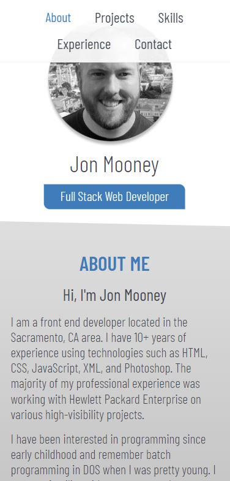

# React Professional Portfolio

## Description

This is a professional portfolio using React as the front-end delivery

[View the deployed application](https://jonmooney.github.io/react-portfolio/)

## Table of Contents

- [Description](#description)
- [Installation](#installation)
- [Usage](#usage)
- [License](#license)
- [Contributing](#contributing)
- [Questions](#questions)

## Installation

- Download or clone the project files to your local system
- Download and install Node.js if you don't have it already
- Open a terminal window
- Navigate to the directory in which you placed the project files
- Type the command 'npm i' to install all project dependencies

## Usage

- Follow instructions from the installation section
- Open a terminal window
- Navigate to the directory you saved your project files in
- Type the command 'npm start' to initialize and run the application
- A browser window will open to show the application

### Screenshot:

## License

This project is covered under the [GNU General Public License v3.0](https://www.gnu.org/licenses/)

## Contributing

If you wish to contribute to this project, follow these steps:

- Fork the repository
- Clone or download to your local
- Make any changes/updates and push to your remote fork
- Start a pull request

## Questions

View my [GitHub Page](https://github.com/JonMooney)

Send me an email @ [jon.mooney@yahoo.com](mailto:jon.mooney@yahoo.com)